# 21-信息安全-AIyueyixz-保研-@SZU

## 前言

趁着还有些感觉，写点什么记录一下。

## 该从哪里讲起

前人之述备矣。在讲述自己的故事之前，给大家推荐一下[欢迎来到海南大学](https://hainanu-application.github.io/#/welcome-to-hnu)这篇文章，相信对你有帮助。

先说一说我对完全学分制的感受，这也算是对[欢迎来到海南大学](https://hainanu-application.github.io/#/welcome-to-hnu)的一个反馈。

> **完全学分制让我们有更多的选课自由。如果你认为本专业的老师讲得一般，可以选择其它学院的你认为讲得不错的老师；如果你对某门专业选修课不感兴趣，你可以不选修然后选择你感兴趣的甚至与本专业无关的一些选修课，只是最后要进行学分转换。当然，老师的水平差异一直存在**

每个人的大学生活都是故事，这很有趣。思来想去还是从大一开始讲起吧！

## 讲些什么呢  

### 高考失利，海大开局😫

高考没考好，来了海大，学了一个不喜欢的专业，怎么办？那就转专业呗！再说，海大的女生很漂亮，男生也很帅，都很养眼，没什么不好的😋

随着时间的流逝，高考的执念和某些东西渐渐地一起消失了......

### 转入成功，我要保研🥰

大二正式转入信息安全专业，这也意味着我需要补修一些大一的课程，比如说高数下，C/C++这些，这也确实给我造成了**不小的麻烦**......因为自己入学以来一直有保研的想法，遂在保研的路上继续准备着！

### 什么！GPA和比赛都炸了😨

大二上疫情的原因导致线上上课，我的学习效率非常低，或者说只有专业课学的比较认真。所以马原和大学英语都考得不高，GPA也下降了一点。没关系！影响不大！！我大二下肯定不会这样！！！然后补修高数下，蜜汁自信+脑抽🤡🤡🤡，我选了免听，最后单科绩点不过3，毛概也炸了，绩点最后只有3.1。我的GPA在大二过后**直接下降了0.12**，排名也翻了个倍，不愧是我😢

大三这一年算是成长速度最快的一年，很多东西都是在大三这一年才认识到的，我不想说太多，因为前人之述备矣，很多东西也需要你自己去感受。

大三开始，我一如既往地卷绩点，同时也开始参加一些比赛。参加过数学竞赛，美国大学生数学建模竞赛，团体程序设计天梯赛，蓝桥杯CTF等等，Unfortunately，**都没拿到国奖**😭至此，我的比赛也炸了。也正是从大三下开始，我变得**非常焦虑**......

我到底能不能拿到本校资格？21级这么卷，我比赛才加这么点分，还有戏吗？保不上怎么办？在如此多不确定性的情况下，我只能选择两手抓：保研+就业。这两手抓可是把我累坏了：七月末还在完善项目作品，为保研比赛加分做最后的冲刺；夏令营各种材料准备弄得我是焦头烂额；就业简历原来得这么写，看来得好好改改了；要面pdd和鹅厂了😱夏令营+期末考试复习**我真的好累**啊！

在经历以上这些之后，学院保研资格名单也快公布了，我的心态也越来越佛系：牛魔的，反正努力过了，没什么遗憾的，再说我也做了两手准备，我不怕的😤

最后，在公布的名单里，我找到了我的名字，旁边是拟推荐！

那一刻，我没有什么激动的感觉，只是有一些恍惚......

### 拜托，这是保研经验分享😅

别...别推我出去，我这就分享经验😆

#### 个人背景

- 鸡排：3.76 13/182
- 综排：3.815 15/182
- 英语：CET4 563 CET6 476
- 竞赛：美赛H奖，天梯赛省二，数学竞赛省一等
- 科研：计算机视觉，区块链+属性加密项目

#### 夏令营

海投如下（不止这些，我很海的😊）：

<table>
  <tr>
    <td>
      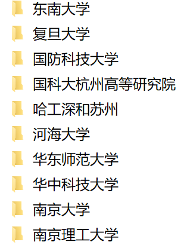
    </td>
    <td>
      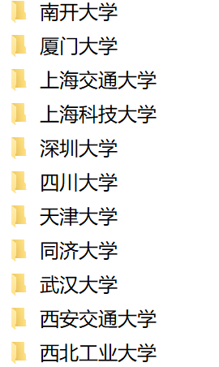
    </td>
  </tr>
</table>

入营如下：

|     学校     | 学院 |      结果      |
| :----------: | :--: | :------------: |
| 中科院信工所 | 三室 |  入营，offer   |
|    西工大    | 网安 |    入营，无    |
|   深圳大学   | 计软 |  入营，offer   |
| 上海科技大学 | SSC  |    入营，无    |
|   东南大学   | 网安 | 入营，候补340+ |

#### 面试经验

##### （1）信工所

双机位+**英语面+项目面+专业课面**

英语：最喜欢的书（还有两个忘了

专业课：数据库+网络安全+密码学

只要**认真复习了专业课**，**英语问答自信一点**，没什么问题

##### （2）西工大

**弱com**

因为是我第一个线下夏令营，所以很冲动直接就去了，飞机直接延迟到晚上23点，第二天凌晨3点才到酒店，最后花了2k+🤡，结果只要跟导师联系好，过了导师那关就行🙂

于是乎我开始联系导师，可能是因为入营的同学都比较优秀，我有些紫杯不敢递简历，加之联系导师线上面试之后没有后续，个人更喜欢北上广深，遂放弃。

##### （3）深圳大学

深大除了给我们夏令营营员安排的宿舍比较一般以外，其它方面都还不错。不论是老师做报告后的茶歇，还是带我们去深圳市人才公园和大潮起珠江展览馆参观，都给了我不错的体验，放点图吧！

<table>
  <tr>
    <td>
      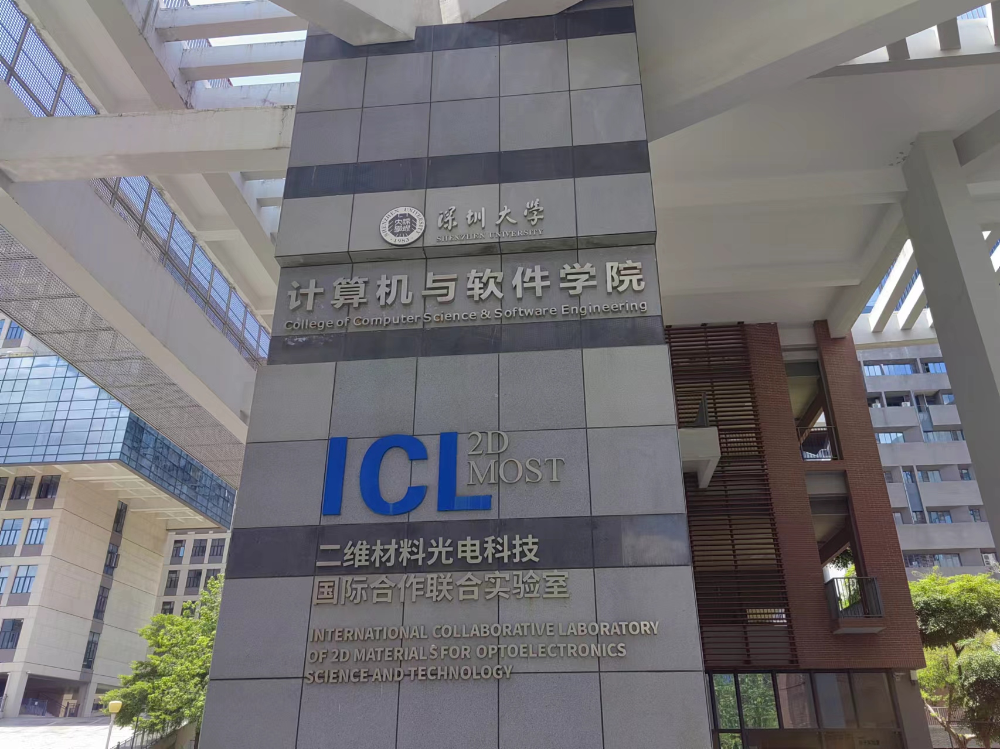
    </td>
    <td>
      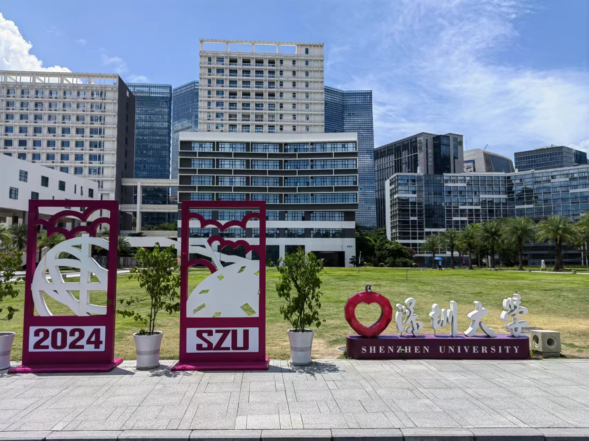
    </td>
  </tr>
</table>

<table>
  <tr>
    <td>
      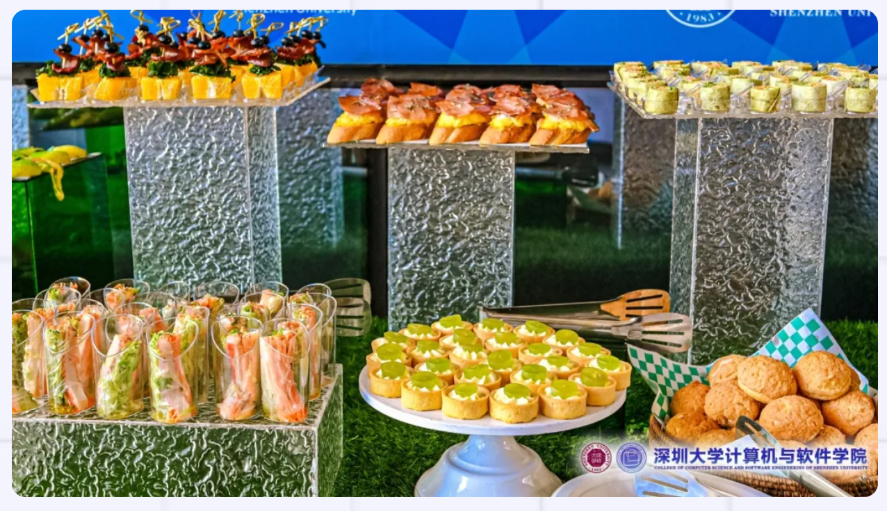
    </td>
    <td>
      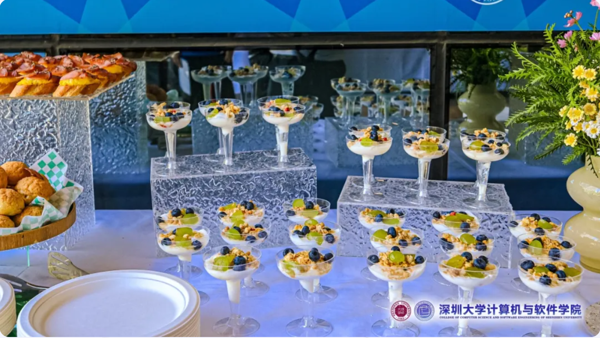
    </td>
  </tr>
</table>

**机考+面对面交流**

我机考10道就做了5道，深大的题还是有区分度的，如果想做满分还是需要多练习的。

和老师面对面交流，细节我不记得了，我只记得当时大家是在一个房间里面，桌上摆满了零食，水果，饮料，边吃边聊，体验很好（光顾着吃了😋

##### （4）上海科技大学

**面试**

主要为**专业课**，我当时被拷打的是计网和密码学，放点图！！吃的还行，住的非常好，就是没把握住机会☹

<table>
  <tr>
    <td>
      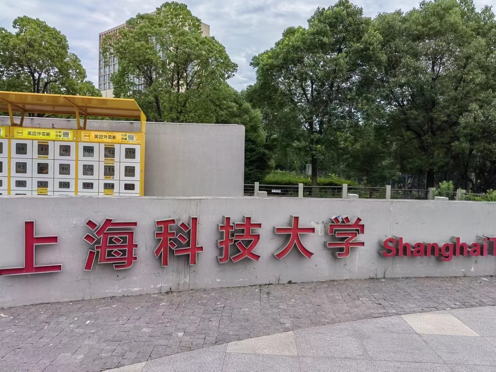
    </td>
    <td>
      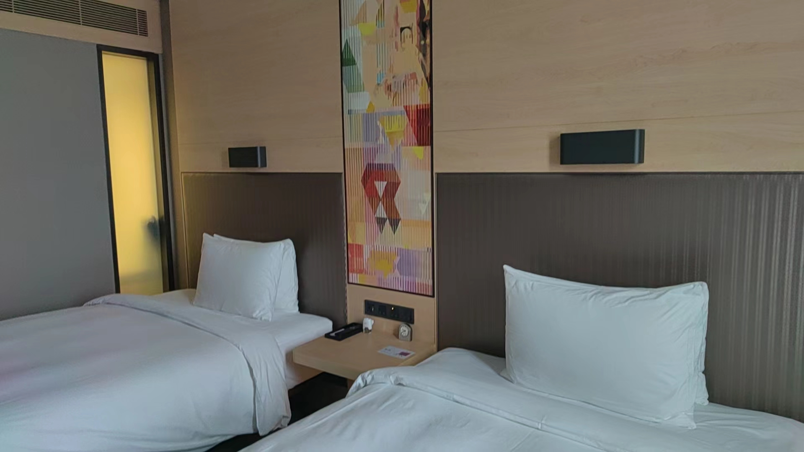
    </td>
  </tr>
</table>

<table>
  <tr>
    <td>
      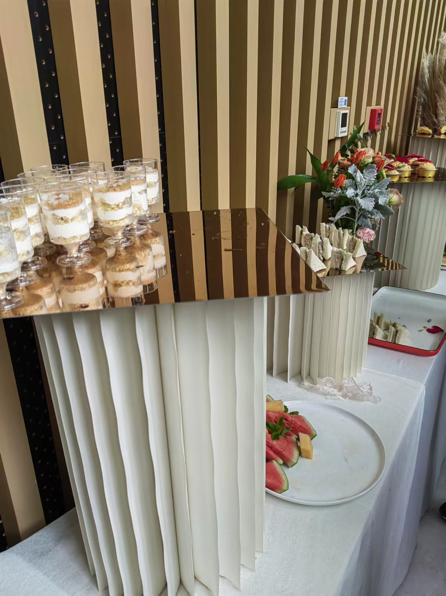
    </td>
    <td>
      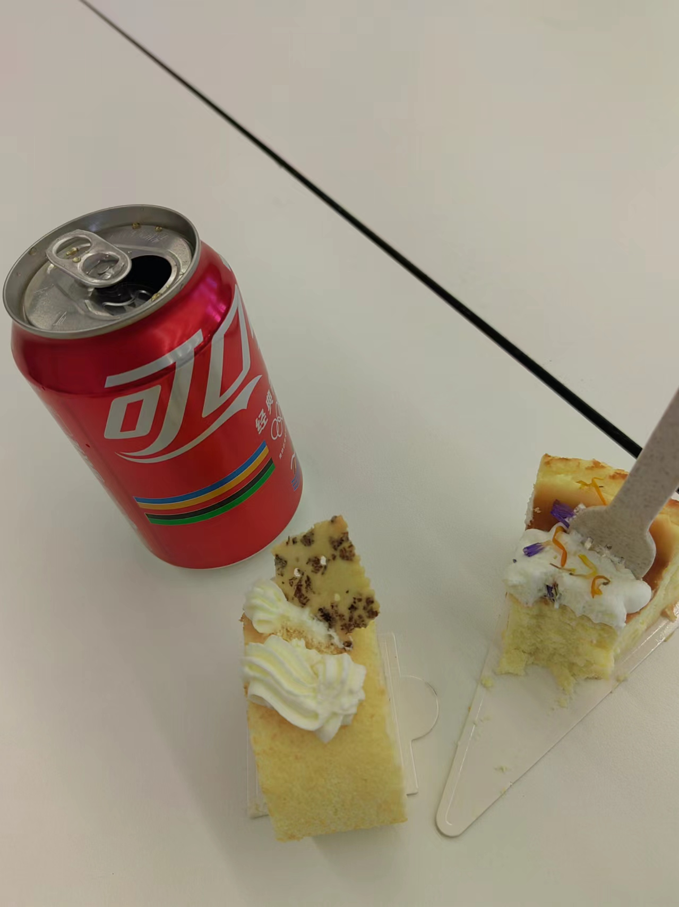
    </td>
  </tr>
</table>

##### （5）东南大学

强com

面试根本没问我专业问题，就问了一个项目问题，还有就是问我们学校的书院制是个啥，别的问题记不清了。也放点图吧！！

<table>
  <tr>
    <td>
      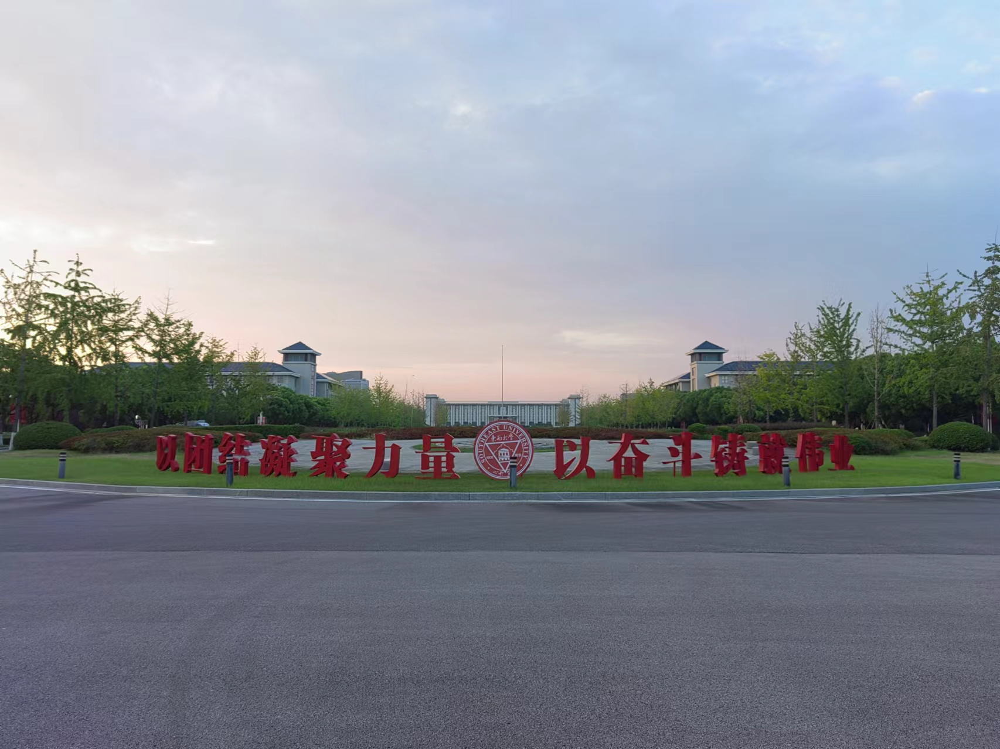
    </td>
    <td>
      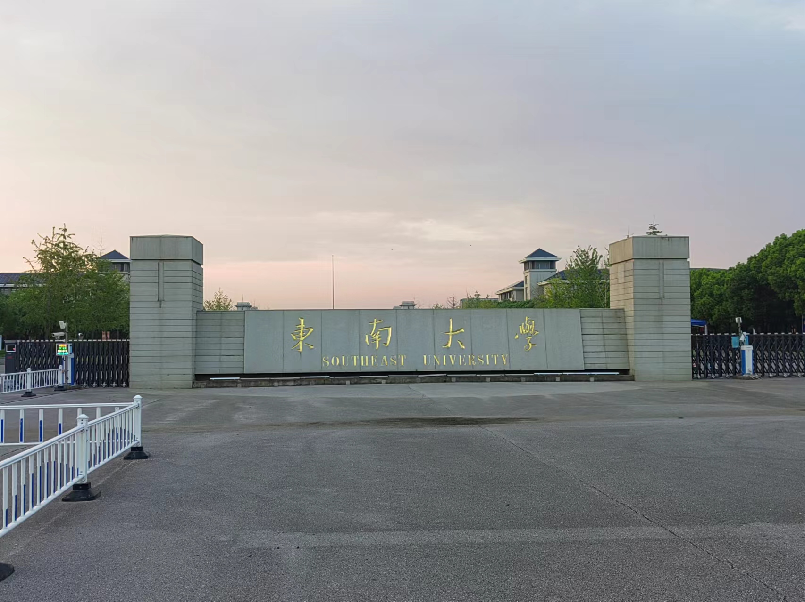
    </td>
  </tr>
</table>

<table>
  <tr>
    <td>
      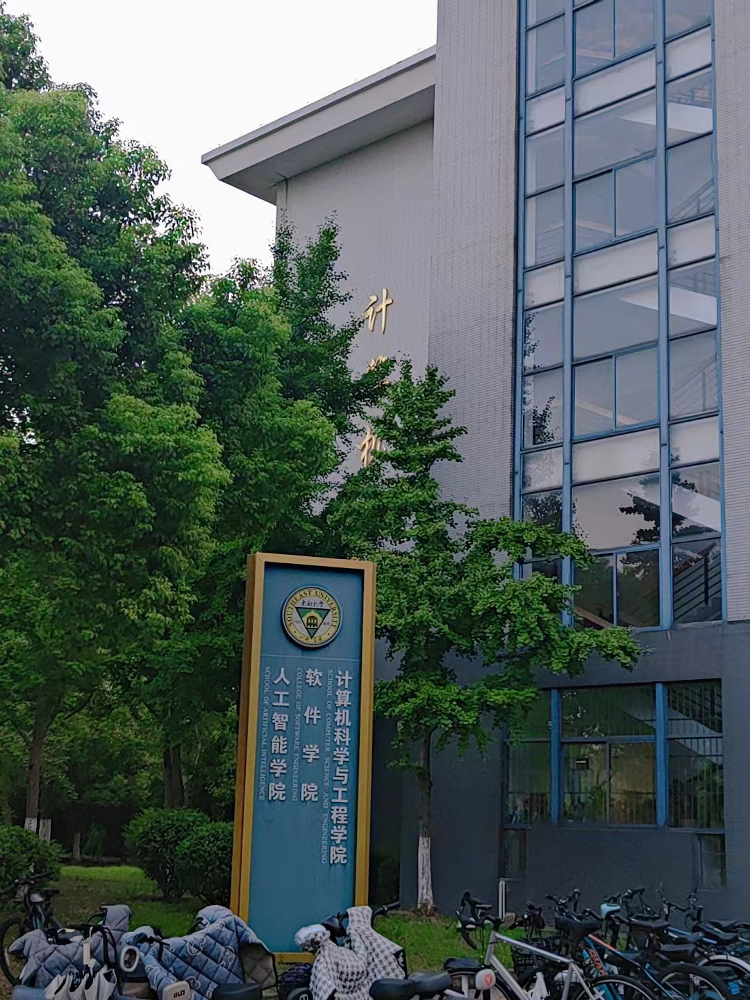
    </td>
    <td>
      
    </td>
  </tr>
</table>
#### 预推免

入了川大和上科大

由于台风和等名额的原因，上科大学专硕的预推免我都没去

川大基本只看机考，机考一般，没offer

面对信工所直博和深大学硕，我在反复权衡之下，最终选择了深大

## 写在最后

我的保研过程很曲折，也很艰难

但我的大学生活远远不止这些

而除去这些的那些，才真正让我觉得弥足珍贵......

QQ：1879687452

欢迎来找我玩！！

​																										      20241001
