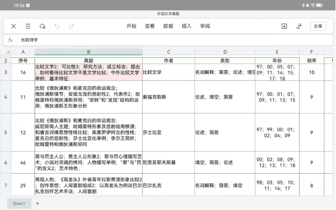
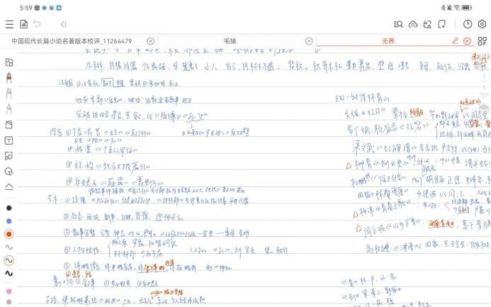
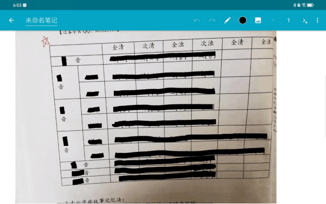
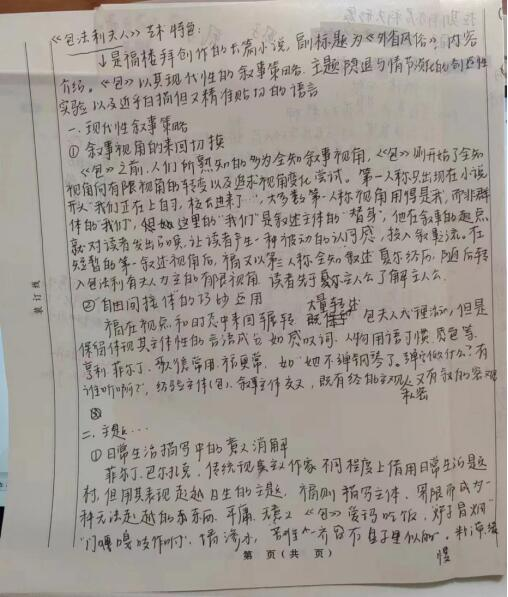
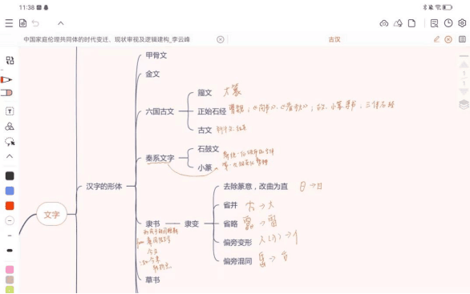

# 关于我和我的考研

收到录取通知书书已经快一个月了，事实上，在这四个月的时间里，我始终被巨大的、厚重的不真实感包围，有一种八百米跑到终点后的虚浮。我想，是时候从喜悦中抽离出来，复盘一下我备考的一年，当作我个人的阶段性总结，也借此机会和大家分享一下我的心路历程，如有些许借鉴意义，便是它最大的价值。

我本科毕业于海大的英语专业。提到英语，我很惭愧几乎没有什么本科课程的心得分享给大家。英语是我高中最差的两科之一，每次考英语前的那个中午我都会失眠，这种失眠和想要呕吐的恐慌在我读大学后的前两年肆意地延展、滋长。就像得了失语症一样，任何新奇的、有生命力的、滔滔不绝的表达在经过语言的转译后都变得残缺和词不达意。因为很多原因，2021年12月我决定跨考现当代文学，将目标锁定在我高中的梦校——川大。在楼梯间看到录取通知的那一刻，我才走出了这四年漫长而潮湿的雨季，理解“上岸”的另一种隐喻。从“大道致远”走到“有容乃大”，这一年，可以用坎坷来形容，有很多弯路和教训，希望学弟和学妹不要再重蹈覆辙。

## 前期准备：资料及基础复习

1月—6月都是我的准备期。这一段时间需要做的事情主要有：购买川大真题及资料、通读各科教材和作品、背单词、跟每日长难句。

> 这里提一下，文学考研主要有三种考察方式，大综合（文学+语言学+其它<如川大还要考察文献学、比较文学。北师大加试儿童文学>+文学评论写作）、小综合（语言学/文学+文学评论写作）、单科考察（报现当代文学就只考现当代文学）。大部分985院校部分211考的是大综合，部分985大部分211和双非考小综合，极少院校单科考察。大综合的优势在于范围广，复习量大，有偏科就会崩盘，但是难度会适当下调。我对自己的时间安排以及执行力比较自信所以铤而走险报了大综合，如果你的时间不够又比较拖延，建议考虑小综合。

### 1、真题和资料：

**真题**：川大真题复现率很高（划重点），一定要反复刷真题、吃透真题，复习重点紧紧围绕真题。我直接购买了川大过客学长（微信公众号：川大中文论坛）的真题全家桶，每一科真题大概有20年，在阅读教材之余，我每天都会抽出一定的时间对真题进行一个系统的整理，包括题目、作者、考题类型、年份，整理完毕后按照频率进行排序（如图）。这项工作虽然繁琐，但是可以直观看到川大的关注热点在哪里，而且在后期背诵和冲刺阶段非常有用（见下文）。btw学长的资料前其实也有标注，我整理是为了呈现到一张表格上以及加深印象。

**资料**：资料我同样直接入手了过客学长的全家桶。我个人不赞同自己从头整理笔记：

1. 前期我试过自己整理古代文学和现代文学的笔记，但是结果是花费了大量的时间精力却收效甚微，记忆效果不如后期背诵。
2. 资料是一个底本，基础知识不需要自己整理也没有抄一遍的必要，比如名词解释、作者、时间、基本影响和意义都比较死，需要补充的是看论文后的一些新视角、新论述或者是详实的作品细节，这些直接补充在资料上就可以了。这一时期其实不太需要资料，因为还没有筛选信息的知识储备和能力。可以在阅读教材和作品之余适当翻翻资料前的真题汇总，看一下大概考点。

### 通读教材和作品

我是零基础跨考，此前只是旁听过文学院现当代文学的一些课程，外国文学只接触过英美文学。所以我花了六个月的时间对所有教材和重点作品（作品选是一个好东西）进行了通读。在时间安排上，我喜欢多线并行的同时略有侧重，即将相似的科目放在一起阅读，1-4月我在看古代文学、现当代文学、外国文学。古代文学结束时间早一点，4-5月我又安排了古代文论接替，然后是西方文论和文学理论基础，最后是5-6月现代汉语（古汉语看了第一册，建议直接背诵）。比较文学和文献学考点固定，我放在暑假过了一遍教材，直接背资料。

### 单词及每日长难句

我本科是英语，所以整个备考过程给英语的时间不多，最主要的事情就是不间断背单词+刷真题。暑假之前主要是背单词，然后每天打卡何凯文的长难句，保持语感。

这一时期除了寒假每天都保持6-7个小时的学习时间外，每天的学习时间都极不固定。因为我们重要的专业课都堆在了大三下，我还一直在生病（后面会谈到健康和心态的问题），所以只能说有空都在自习室看书，就这样竟也陆陆续续看完了，也算是开了一个好头！

## 中期积累：公共课、疯狂背书和看论文

时间很快来到暑假，这是备考的黄金时期。7—11月初是我提升最快的一段时期（其实具体一点是9—11月，因为7月、8月两个月我都在生病，住了两次院，耽误了很多时间，我不得不想尽办法提高效率）。7月初我开始了公共课学习。专业课上7月份我快速过了一遍古代文学和现代文学，阅读了文献学和比较文学教材后留给我的备考时间就已经不多了，8月底我开始背书以及论文补充阅读。

### 公共课

**政治**：2倍速刷徐涛马原部分，在肖爷爷政治教材上补充内容，听完一节就做对应1000题（花1元买个刷题小程序，可以反复刷）。其它部分每天看一章又做题，时间绰绰有余，不要在意正确率，看知识点，马原部分一定要多多复盘。腿姐背诵手册出来之后反复翻，有事没事就翻出来看看，烂熟于心。然后坐等11月底的时政和肖8肖4。

**英语**：我只刷了09年—18年的真题，大概做了三遍，留出4年模拟。第一遍我只做阅读，两天一套，找张纸写自己的答案，不写在试卷上，做完后订正，不要太在乎正确率！！

1. 重点总结生词、熟词僻义以及自己没有熟练掌握的词汇，找个笔记本记录一下。
2. 分析长难句
3. 最最重要的是总结答案，为什么选这个，为什么选错，其它答案坑在哪里。第二遍加入完形填空，第三遍加入新题型。我个人感觉英语能读懂做不对关键在于没有摸清出题老师的命题逻辑和习惯，比对法简单粗暴（词汇、语法是最喜欢偷梁换柱的地方）。

公共课网上经验帖很多，可以多翻翻，政治前期无需花费太多时间，英语我纯啃基础，大家可以再多参考一下。

### 专业课背诵

我八月底才开始背诵，其实时间是有点赶的，从九月开始每天的背诵时间基本上是6-8个小时，一天中大部分时间都在背书。

1. 背诵心态：背书一定要有一个良好的心态，记不住是常事！第一天背第二天就忘记很正常！第一遍背完翻到第一页发现全忘了也很正常！有些太绕了背不下来特别特别正常！不要太焦虑。需要做的就是不要放弃不要崩盘，一遍一遍背，常看常新！第一遍背是最难熬的，背到第二遍第三遍的时候对知识的理解会有巨大的飞跃，大综合之间开始融会贯通，然后渐入佳境。给自己一些时间量变！
2. 背诵安排：8月底我把真题的名词解释都背了一遍，我觉得背名词解释是一个快速理解概念的办法，背完名词解释后就对核心概念有了一个大概的记忆。9月—11月我和阅读教材时的方法一样，把相似的科目放在一起背诵（直接背资料和自己的补充笔记）。我把一天切割成早中晚，三个时间段各背一门学科+看对应的考点频率和真题，复现率高的真题以及我答不好的知识点我会适当补充论文并且整理背诵。每天的规划是背一章，但是也会根据实际进度略有调整。第二天会抽出一点时间快速回顾第一天的背诵内容。
3. 背诵tips：

> **复述**为主：不要逐字逐句背，没有意义。我6月尝试过这样背诵，记忆负担太大了，很有挫折感，浪费了很多时间，后面又在从第一页开始背。总之除了时间作者文集等基础知识需要细节记忆外，其它的知识没有必要全部还原背诵。我喜欢把自己想象成正在答辩的人，然后向别人讲述我对xx知识的理解，在这个过程中你可以适当扩展或者删减，甚至主动举出更多例子来证明自己的观点。文学是鲜活的、联系的，资料只是一个底本，不要被它框住。
> 适当 **默写** ：我第二遍背诵的时候会在背完后默写关键词来检验自己的记忆（也可以算再背一次）。这个方法特别适用于比较文学、语言学以及文献学（划重点）。这几门最突出的特点就是以简答、论述考察为主，而且考察方式直接，切口大，所以第一遍背诵就可以直接上手默写关键词，提高背诵效率。
> **挖空法**：对于一些难背的基础知识可以采用挖空的方式辅助记忆。以记忆三十六字母为例，我先将这个表格拍照粘贴到平板上，然后把关键信息用黑色笔划掉，对着表格口头复述，轻触就可以去掉黑色笔迹看到正确答案，最后再用撤销键盖上答案方便下次复述。后期的腿姐时政记忆我也是采用这个办法，非常好用！！

### 看论文

论文的补充是必不可少的，这毕竟是研究生考试不是期末考试，光靠背书是远远不够的。论文可以扩展自己的学术视野，培养论述逻辑，里面精彩的观点和学术用语可以直接拿来答题。我初试大概读了160篇论文，对文学研究的理解深入了很多。

#### 在哪里找论文，找什么样的论文

我的论文都是从知网下载。知网登录有一个“校外访问”的选项，用学生证和密码登录可以直接下载大部分论文。人文社科中文论文我的优先级是：C刊＞核心期刊＞普刊。如果实在没有前两个再根据质量看普刊。

#### 读什么样的论文，怎么利用论文

因为备考时间紧任务重，所以我也不是漫无目的读论文，读论文的主要依据是真题，尤其是简答和论述题。**反复复现的真题**必读论文，并且读完之后要对论文的论点进行概括、整理和复述。其中较好的论据也应该一并整理背诵，作为素材库灵活使用。除了真题出现简答、论述题要进行论文补充阅读，一些复现较多的知识点、其它院校的真题热点、部分学术前沿问题也可以适当补充文献。多读文献总是没有错的。

以川大915文学大综合中外国文学一道真题为例。《包法利夫人》是川大尤其爱考察的一本书，考点涉及艺术特色、叙事手段、作品比较等等。我在准备时特意看了做福楼拜研究的刘渊老师撰写的多篇论文，看完之后以模拟答题的方式（名词解释+总结+分论点+论述）进行了整理复述。可以看到比起单一的、固定的知识点，我的答案既有叙事学的理论、详实的分析论证，又有一定的延申和比较意识。这样的答案就是比较理想的答案。

## 后期冲刺：公共课、模拟答题和复盘

后期冲刺是11月--考研。这一段时间看似时间紧迫，但只要争分夺秒，提高效率，反而是知识整合、升华，见证质变的时刻。这段时间要把重心移到公共课和答题模拟以及复盘上。同时心态也要调整好。

### 公共课：

**政治**：

1. 11月肖八就出来了。肖八可以选择只做选择题部分，还是不要太纠结正确率，这个时候要做的就是计时拉通做完一套——订正答案，在腿姐手册上看相关知识点——积累时政——反复刷。我最喜欢吃饭前排队用小程序刷一套。
2. 时政，很多老师都会出时政相关汇总，不用纠结选谁，都可以。我用的是腿姐的时政，好像是九页纸（江湖称呼），具体记忆方法就是上面提到的挖空法，吃早餐的时候就看一部分，效果很好.
3. 主观题，12月肖四就出来了，也就是主观题押题出来了。肖四除了选择题要精做，后面的主观题也要 **全部背诵（意思是要关上书可以直接默写）** 。其它老师的押题有精力也可以看一下，没精力就算了，背好肖秀荣，政治70+已经很够用了。

**英语**：英语这段时间要开始准备大小作文了。单词还是不能放，买黄皮书送真题词汇，可以拿出来直接过。真题之前留了近三年，现在可以拿出来当模拟题，计时做。作文我买了一本王江涛高分考研写作（强推）。大小作文可以按照主题和体裁分类，前者积累单词和句式，后者积累格式。跟着王江涛这本书自己写，找个本子先学习他的格式和句式，把多篇精华缝合在一篇里面，总结出正确格式和常用词汇。自己形成一个模板范文，导入作文批改网，进行语法修改和高级词汇短语替换。我每天晚上大概11点离开自习室，然后会花四十分钟左右总结作文模板，12：30左右睡觉。在考场上基本上可以做到看完题目直接输出我自己的模板。

l**专业课**:

1. 专业课背诵：最迟到11月中旬，要保证专业课全部科目完成了至少2-3遍的背诵，其中古代文学、现当代文学、外国文学、东西方文学理论应该扎实过完两遍，并开始了第三遍。背诵必须背到上考场前一刻，方法还是如上。不过这个时期背诵的时候可以适当穿插关键词默写+知识体系建构。这个时期我引入了思维导图（语言学部分是自己一遍背一边做的，背完后关上书自己画思维导图进行检验；文学是网上随便找的）。对着思维导图进行补充和联想复述，既可以检验背诵，又可以进行知识点串联。

2. **模拟考试** ： **一定要！千万要！进行严格的模拟考试！** 文学考试题量大、论述多，川大科目跨越广而且题型多，在考场上3个小时基本上要写10-12面纸，几乎没有时间思考。如果对自己的答题效率没有概念，对答题时间没有规划，在考场上很容易心态爆炸。所以进行模拟考试是非常非常有必要的。考川大文学的话可以直接报名过客学长的模拟考试，有模拟题+还原考场（到点才发卷+严格计时）+批改。（不是广告！！我也不是托quq！参加了都说好） 我真的很庆幸当时参加了这个模拟考试。一方面确实对考试的时间有了具体的感受，另外就是对考试有了不一样的想法。在这个过程中会遇到很多涉猎不深的题，这个时候只能硬着头皮去编去头脑风暴，本来以为答题很糟糕，但是最后发现分数还不错，再回看当时被逼着写出的答案，竟然还不错。一下子就意识到没有必要过分苛责自己的记忆精度以及完美的答案呈现，考试拼的就是怎么在有限的时间做完题，并且有亮点。可以说正是这个认识对我后面的复习思路以及答题思路产生了巨大的影响。

3. 复盘：复习进行到这里，复盘应该说已经养成了习惯。不仅每天都要复盘今天做了什么没做什么，每一遍背完书都要复盘刚刚背了什么，也就是我一直说的“检验”，为了清楚地知道我到底有没有理解一个知识点，我发明了很多检验的办法，但是这些办法最终都指向一个标准：我能不能对知识进行转述。这个时期应该对复盘更加清醒和敏感。

4. 其它学校真题题库+热点话题：只看自己院校的真题其实不太够，因为它再喜欢重复考也有考完的一天，我们可以适当参考一下别的院校真题。推荐一下微信公众号“故知文学考研”，11月开始，它每天都会推送院校文学考研真题，我利用碎片的时间大概刷了一遍。快速看有没有自己不知道的，立即打开百度查；论述题有没有思路，迅速组织一下论点。这样下来，基本上可以把主流或者是核心知识一网打尽，也能补充很多没有复习到的。热点话题包括重要周年、理论前沿，可以关注一下微信公众号“文研青年”，它会推一些热点专题，还是很有利用价值的。

5. Btw我很喜欢给别人讲题，常混迹于各大考研群答疑。这样既可以见识到各种各样的题目，又可以鞭策自己去翻论文去思考，同时也是一个知识输出的过程，我觉得不想背书以及碎片化时间可以这样做一下加深理解。

## 关于健康、心态及结语

其实这篇文章到这里就应该结束了，不然显得过于冗长。但是我总觉得自己还有很多东西没有叮嘱到，还有很多我踩过的坑没有写出来。思来想去，不怕大家觉得我废话连篇，我还是想说一下健康和心态的问题，这个可能是考研过程中最折磨的两件事情。

我从考研开始（2022.1）就一直在生病，一月份慢性胃炎去医院做胃镜；三月份颈椎病去医院拍了核磁共振开始理疗，心态一度崩掉；七月份和八月份又因为劲椎病和腰肌劳损住了两个月的院，本来九月份就应该返校，又因为疫情和一些需要彩超复查的病拖到11月才回学校。期间哭过多少次已难以回溯。但是那种痛苦和焦虑却依然记忆犹新。川大是大综合，我需要看的书大概是30本，需要熟背的书是十余本，可想而知我的复习压力有多大。但是在这个过程中我学到最重要的一点是： **不论什么时候开始，只要开始，就能有收获，学习没有白走的路。** 即使我睡到下午三点，我也很少内耗，而是直接爬起来背书，依然可以完成今天的背诵。在医院住院的两个月里，我虽然进度慢了，但是从来没有放弃，总能找到很多空余时间学习。每次崩溃我都会提醒自己：崩溃可以，接纳自己、允许自己产生负面情绪，但是哭过之后还是要继续赶路，不要陷在无休止的内耗里面，一步一步走向正循环。

我想说的就是：

1. 按时吃饭，好好睡觉
2. 书立着看，不要一直坐着，可以走着背书，换来换去
3. 接受自己会犯错，少想多做，时间会给出答案

没有提到的地方还希望大家多多补充。

最后很感谢有这样一个机会可以让我再回望考研这一年的得失，分享我的收获与感悟。我不是一个很聪明的人，但我认可自己是一个足够努力也足够幸运的人。在备考的无数个瞬间我都以为考研是生活唯一的事情，想用热情、健康来交换理想的结果。但当我终于翻过这座大山，才后知后觉，海的另一边还是海，我还在水里沉浮，彼岸如此遥远。考研并不是终点，许多没有考研的朋友同样在自己喜欢的领域大展身手，有其它的幸福和烦恼。这就是生活，无论选择哪条路，都会后悔失去了另一条路的风景，但至少这一次，我终于走上了自己选择的道路。我把这份幸运传递给大家。祝福大家一路顺畅，见识雪山映日，碧海银沙，欣赏到别样的风景，然后明年此时，如约在岸上相见！

