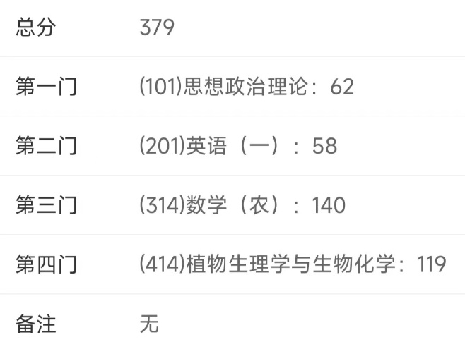

> 下面是我的一些考研情况，希望能给大家起到一点借鉴作用。

**截止复试前GPA**：3.44（8/52），除3年奖学金外再无其他有含金量奖项。
**考研院校和专业**：上海交通大学园艺学（学硕）
**初试第3，综合第7**。初试成绩如下。

> 下面我将从院校专业选择、搜集和分析信息、学习规划、心态篇这几个方面来对考研进行简单的剖析。（以我本人为例）

# 一、院校专业选择

首先我觉得考研的选择大于努力（如今年部分985爆冷），自我衡量非常重要，目标不能过低也不能高的离谱，一定要根据自己的实力来选择。院校的选择可以先选个大类（比如说工科或者理科），这样你的公共课不会变，都是学数学英语政治，等到大概数学或专业课一轮复习结束的时候再确定院校（如果数学一学得吃力可以转数学二，千万别心疼钱），那个时候再看专业课也不迟。

关于我的择校经历也很简单，一是我考的是难度较小的农科，二是在复习的过程中自我感觉良好，所以我初步以中国农大作为我的目标院校。一直到9月预报名的时候，我才更改了院校。取乎其上，得乎其中；取乎其中，得乎其下；取乎其下，则无所得矣。所以，前期只需要确定一个大概的院校方向即可（如中国农大、交大、浙大、华中农大、海大）。

# 二、搜集和分析信息

选择学校的时候一定得注重搜集你目标院校的信息，比如说报录比，复录比。但是我们也要关注报考院校专业的各科成绩，注意某些学校的专业课会压分（名副其实的黑校），黑校不建议大家报考。我觉得初试就是过不过线的问题，这个主要看大家自己。

搜集完信息就要开始分析数据了，主要是大概预测一下今年会是什么情况。如果报名你心仪的院校专业，再结合自身实力，上岸几率有多大？概率太小或录取人数少于5人，建议慎重报考。

# 三、学习规划

适合自己的学习方法才是最好的，我建议大家可以去考研吧、b站、知乎看看学霸老哥们的学习方法，一边模仿一边改进，最后就能形成一套适合自己的学习体系。

## （1）什么时候开始学习？

一般是在大三下学期刚来学校的时候——即3月份左右。晚点准备固然是可以的，但是就需要好好衡量自身，定一个符合自身实力的院校。考研当然是越早准备越好，这样你后期就会有更多的时间总结与刷题模拟。

## （2）各科学习规划

### ①政治

暑假之前不用看，暑假每天1.5倍速看点徐涛强化课放松一下。
做肖1000, 想考高分的可二刷。11月底开始做肖8肖4，12月初疯狂背肖8肖4大题即可。（可以用微信小程序——苍盾考研政治题库刷选择题）

### ②英语

没什么好说的，每天坚持背单词，制定好计划。可用单词书（红宝书、闪过等）和单词APP（扇贝、不背单词、墨墨背单词等）结合进行打卡背诵。
阅读、作文、完形、翻译、新题型都可以先听网课，再进行做题训练。（只用做真题）
关于各类题型时间分配及什么时候开始学习问题，网上都有。
最后，还是想啰嗦一句，好好背单词，背好单词好比一力降十会。（丁真）

### ③数学农

数农相比于数一、数二、数三要简单的多。虽然考3本书，但是难度不大。
我建议按照数三的要求来学习数农，同时参照大纲进行学习（例如数农不学无穷级数，可直接跳过）。
选书：中农出的复习指南+真题，基础过关660，汤家凤1800（做基础部分就行，虽然强化我也做了）。
网课：一般是全程跟一位老师。我基础阶段全程跟张宇老师，强化阶段中，高数跟武忠祥老师，现代跟李永乐老师，概统跟余炳森老师。
数学学习周期长，要下功夫，不要眼高手低，多做题多思考。

### ④414植物生理生化

专业课没什么难点，最重要的是梳理知识点，后期好进行背诵。
建议每章绘制思维导图，并尽早开始背诵知识点。
学习方法：网课+研读课本+习题。
专业课的学习没有捷径，每天复习旧知识，再背诵新知识，重复再重复，直至考试。（我从7月份开始背诵，持续到考研前夕）

# 四、心态篇

> 考研是场持久战，保持良好心态和身体至关重要。

## （1）明确的动力和目标

每个人都有自己考研的原因，可能是为了更好的就业，更多的选择，赚更多的钱，或者是为了弥补高考的遗憾，学习另一个专业的知识。大家一定要想清楚读研的原因和目的，才有勇气长久地坚持。

## （2）多运动，保持身体健康

身体是革命的本钱，只有保持一个强健的体魄，才能更好的学习，心态也会变好。

## （3）每天适当放松

拍皮球（前期每天一次，后期一周1-2次），抖音、贴吧、B站、游戏，但这些一定要有节制，不能沉溺其中。

# 五、写在后面

准备工作做好后，但行好事，莫问前程，干就完事了。海带的学生要自信，敢想敢干，一切皆有可能。
最后不论大家考研与否，愿大家都能做生活的高手。（doge）
