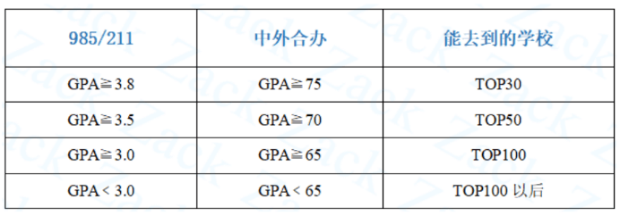
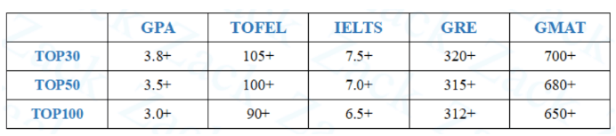

# 留学经验分享

各位朋友们大家好，我是19级生态与环境学院的郭佳慧，来自内蒙古呼伦贝尔，即将前往美国Top30北卡罗来纳大学教堂山分校（UNC）攻读环境工程硕士。很荣幸能在飞跃手册上将我在留学申请中的一点儿经验分享给大家，希望能对有留学计划、特别是想申请美国留学的朋友有所帮助。

不知各位朋友如何看待留学这件事，相信大部分人会像当年的我一样，以为留学国外是遥不可及的。但实际上，这并非什么可望不可及的事情，我们要做的就是消除信息差。

留学跟考研保研一样，都是升学的一种途径，只不过是去国外读研究生，随着时代的发展，海外留学逐渐从精英化向平民化发展。

我的个人情况如下:

**绩点**：3.5

**TOEFL**：90

**获得奖励**：综合奖学金 三好学生

**其他**：一段科研 两段实习 无论文 国际志愿者经历

**奖学金**：留学小奖 

## 1.明确想要出国留学的原因

和保研、考研一样，出国留学的准备过程也是一场需要耐力的持久战，过程中你可能会面对语言分数不够高要一次次刷分、你可能需要以200%的精力维持住一个有竞争力的GPA、你可能陷入到 我能行吗，这好难呀 的怀疑中无法自拔......如果没有在最初就下定决心、定好目标，很可能一开始的满腔热情和无限憧憬会以中途放弃告终。因此，明确自己为什么想出国留学非常重要（职业发展/异国文化），因为这是激励你自己坚持下去的动力源。

我明确自己出国留学的想法源自大一寒假时参加了海大国际交流合作处和中外友好服务中心组织的自费项目赴美国际志愿者实习，去到美国波特兰的一所中学担任为期四周的助教老师，期间是住在当地的寄宿家庭里，周末的时候和一起参加项目的伙伴去了西雅图、旧金山等地体验风土人情。那次经历我眼界大开，我看到了另一个国度里的人是如何工作、学习和生活的，喜欢上了中西方文化碰撞带来的新鲜又奇妙的感觉，同时我结识几位有理想、十分独立自信的女孩子，这一切在我心里埋下了一颗留学美国的种子，我想我的人生会因此拥有更多的可能性

建议有机会和条件的，可以通过多种多样的短期项目或学校交换生提早感受留学生活，从而确定出国读研是不是你想要的。

## 2.如何规划和准备

机会是留给有准备的人的。确定要出国留学之后就要尽早开始准备了。结果导向，我们可以按照申请所需的诸多条件提早做规划。

留学美国看重申请者：绩点，语言成绩，软背景（论文科研经历绝对加分项，比赛没那么看重，社团活动对理工科不加分），推荐信。

1. 绩点:GPA是留学申请的基础门槛，基本上决定了你可以申请的学校档次，是比语言成绩更重要的存在。要想申名校，提高绩点是重中之重，有的学校或者项目会明确要求申请者的最低GPA。早早就决定了要出国读研的同学，那么从大一开始你就必须非常重视GPA，等到大三时专业课占比大，这阶段的成绩对于申请尤其重要。（这个也不是绝对的，要因学校、因人而异，这里更多是想强调GPA对于申请的重要性）
   一般来说，GPA3.0是美国大多数学校的基准线，低于3.0就比较危险了，并且985/211和双非的3.0在认可度上是有差距的，一些热门专业（比如计算机、商科等）对于GPA的要求会更高。

2. 语言成绩:常见的语言考试有雅思和托福，雅思和托福考试的有效期都是两年，在保证申请时成绩仍在有效期的前提下，一定要尽早准备语言成绩，比较合适的首考时间是大二结束的暑假，最好在大三寒假前能出分，否则时间会很紧张。

3. 软背景——论文和科研经历是很加分的，但我认为大可不必花钱去搞背景提升。早点儿主动联系导师、加入实验室，争取积累一些参加项目的经历，甚至发表论文，就足以让你在书写简历和申请文书中有不错的表现了，除非是要冲击顶级名校。

4. 推荐信——平时多主动和老师沟通，给老师留个好印象，这么做可以为自己积累申请时的推荐人。推荐人最好是和你接触较多、比较了解你的人，如，班主任、学术导师、系主任、实习单位领导等。一份强有力的推荐信能在一定程度上提高录取概率。

如果是考虑跨专业申请的学弟学妹，一定要尽早去积累自己想去专业的实习和实践，证明自己有足够的实力进入这个专业学习。

### 获取信息的途径

现在网络上的信息可谓是应有尽有，用好各种信息平台是我们消除留学申请中信息差的关键所在。我常用的获取的信息平台有寄托天下（论坛）、一亩三分地、指南者留学APP、小红书、知乎、公众号（超哥留学、寄托天下等）、B站、新东方官网、续航教育网站、US News Education官网、各学校官网等。这些途径能帮助你检索到心仪院校的录取案例，包括录取的语言分数、绩点和科研实习背景等信息，可以作为准备阶段提高分数的参考标准。

### 关于择校的一些建议

留学申请可以同时申请多所学校，申请十几二十所的同学大有人在，也可以英美澳加港新等多地混申。但申请的学校越多，也意味着更多时间和金钱的投入，因为不同学校需要你提交不同内容的申请文书，还需要交不同金额的报名费。选学校时建议最好咨询专业的机构或老师，把你的综合条件告知对方，让专业人士给出比较合理的评估和选校建议。一定注意不同学校的申请截止日期不同，要在相应截止日期前提交完整的申请。

## 3.语言考试

### 考托福还是考雅思

**雅思**：更适合英联邦国家留学的同学。如：英国、澳大利亚、新西兰、爱尔兰、荷兰等。美国很多学校也接受雅思成绩，但部分学校不认可，更希望学生参加托福考试。

**托福**：托福适合去北美国家的同学。主要是美国和加拿大，大部分英联邦国家也都认可。	我的建议是如果你想只申美国，那可以考托福，毕竟托福的应用范围更广，不会受任何限制；如果考虑英美一起申的话，可以考个雅思，因为英国绝大部分学校是不认可托福成绩的。

两者难度对比：阅读难度相当，听力、口语托福更难，写作雅思更难。

### 是否要报语言班

托福或雅思，说到底还是一种考试，是考试就有考试技巧和真题，报语言班主要是完成考试技巧学习这块儿，学会技巧后就得多刷几遍真题了，但这不大适用于口语的提高，口语始终是中国考生的痛，很难短期有明显提升，大家的口语分数普遍不是很高。

从时间和金钱成本出发，是否报班，还是要看自身的英语基础，我的建议是英语基础很不错的同学（我觉得差不多要六级550分以上的），利用网络上的海量免费资源自学足矣，推荐B站上的李文勍Richard清北托福慕课（有答题技巧和详细的托福单科学习规划，由弱到强进阶训练）、B站上野性猛哈哈（托福部分阅读真题的讲解）、用小站托福APP（也有小站雅思）上的TPO刷题 考满分、到闲鱼上买托福真题电子版刷题（考试中有一定概率遇到考过的真题）、B站上很多经验分享。

对于英语基础不够好的同学，不大建议自学，因为出国语言考试还是很有难度的，报班系统的学习听说读写四项更合适，避免多做无用功浪费时间。推荐西柚西柚Online的网课和新东方网课，口语推荐狸老师讲堂（公众号课）。另外新东方的口语和写作素材相关的书特别好，推荐使用。

## 4.关于是否找中介

当然，找中介帮助申请是比较稳妥的选择，但在我看来不是一定要有中介才行的，很多同学会选择自己DIY或半DIY申请，面对的问题会很多，过程会比较艰难，需要付出大量的时间和精力。建议决定留学时最好和父母商量并得到他们的支持，在决定是否找中介时也和父母商量好，毕竟当前父母是我们的金主。

我自己差不多是半DIY的，没有找中介，但申请时获得了国外朋友的一些指点和帮助。时间比较充足的情况下，大家可以大胆选择DIY或半DIY申请，大部分问题自己都可以克服的，在定校时找专业人士帮帮忙，申请文书可以自己写好后找中介机构或老师 同学帮忙润色修改。

## 5.总结

首先我们要明确自己想要留学的动因；（打长期战的动力）

留学的准备阶段如何做出清晰地规划；（绩点、语言成绩、科研实习、推荐信）

用来获取信息以缩小信息差的途径有哪些；

关于语言学习和是否找中介的建议。

大部分时候，我们的一个目标能否达成，并非取决于我们是否天资聪颖，而更多取决于我们实现目标的决心是否坚定。愿我们都能坚定理想，勇往直前，拥有灿烂人生！

感谢各位观看，敬请批评指正。